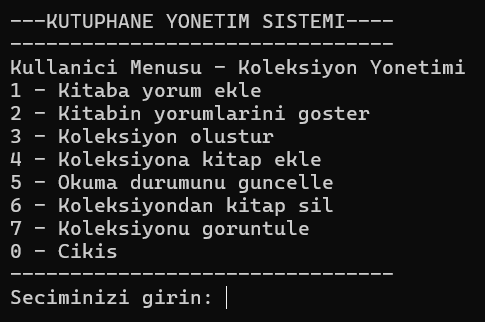
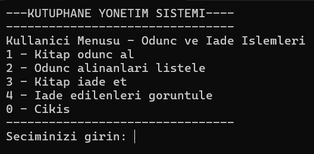

# Veri Yapıları Projesi: Kütüphane Yönetim Sistemi

## Proje Özeti

Bu proje, bir kitap yönetim sistemini veri yapıları kullanarak geliştirmeyi amaçlamaktadır. Sistem, personel ve kullanıcı olmak üzere iki farklı giriş noktası sunmaktadır ve 5 modülden oluşmaktadır. Her modülde farklı veri yapıları kullanılarak kitap yönetimi, ödünç alma/iade, talep yönetimi ve değerlendirme gibi işlevler gerçekleştirilmektedir.

## Kullanılan Veri Yapıları ve İşlevleri

### Modül 1

- **Personel Girişi**: Tek Yönlü Bağlı Liste  
  - Kitap ekleme, düzenleme, silme  
  - Kitap listeleme ve arama  
  - Sıralama ve filtreleme işlemleri  
  - Hasar bildirimi yönetimi  

- **Kullanıcı Girişi**: Çift Yönlü Dairesel Bağlı Liste  
  - Kitap yorumları yönetimi  
  - Kişisel kitap koleksiyonu oluşturma ve yönetme  
  - Okunma durumu takibi  

### Modül 2

- **Personel Girişi**: Tek Yönlü Dairesel Bağlı Liste (Stack'ten aktarım)  
  - Ödünç alınan ve iade edilen kitapların raporlanması  
  - Erişilebilir kitapların listelenmesi  

- **Kullanıcı Girişi**: Yığın (Stack)  
  - Kitap ödünç alma ve iade etme  
  - Ödünç alınan kitapların listelenmesi  

### Modül 3

- **Personel Girişi**: Kuyruk (Queue)  
  - Talep edilen kitapların tedarik edilmesi  
  - Kütüphaneye yeni kitap ekleme  

- **Kullanıcı Girişi**: Kuyruk (Queue)  
  - Kitap talebi oluşturma  
  - Akademik kitap taleplerinin önceliklendirilmesi  
  - Taleplerin listelenmesi  

### Modül 4

- **Personel Girişi**: Ağaç (Tree)  
  - Ödünç alma sürelerine göre rapor oluşturma  
  - Basım yılına göre kitap filtreleme  
  - Özel durum kitaplar için rapor oluşturma  

- **Kullanıcı Girişi**: Ağaç (Tree)  
  - Yayınevine göre kitap filtreleme  
  - Dillere göre kitap filtreleme  
  - Sayfa sayısına göre kitap filtreleme  

### Modül 5

- **Personel Girişi**: Hash Tablosu  
  - Kitap puanlarının yönetimi  
  - Yüksek puanlı kitapların listelenmesi  

- **Kullanıcı Girişi**: Hash Tablosu  
  - Kitap puanlama sistemi  
  - Benzer kitap önerileri  

## Sistemin Çalışma Mantığı

1. **Başlangıç**: Sistem çalıştırıldığında, ana menü ekrana gelir ve kullanıcı veya personel girişi seçeneği sunulur.  
2. **Personel İşlemleri**:  
   - Kitaplar tek yönlü bağlı liste ile yönetilir.  
   - Ödünç işlemleri stack'te tutulur, raporlama için dairesel listeye aktarılır.  
   - Talep yönetimi kuyruk yapısı ile gerçekleştirilir.  
   - Analizler ağaç yapısı kullanılarak yapılır.  
   - Puanlamalar hash tablosu ile yönetilir.  
3. **Kullanıcı İşlemleri**:  
   - Kişisel koleksiyon çift yönlü dairesel bağlı liste ile yönetilir.  
   - Ödünç işlemleri stack üzerinden yapılır.  
   - Talep işlemleri kuyruk yapısı ile gerçekleştirilir.  
   - Filtreleme işlemleri ağaç yapısı ile yapılır.  
   - Değerlendirme ve öneri sistemi hash tablosu ile çalışır.  

## Sonuç ve Değerlendirme

Bu projede, kitap yönetim sistemi için farklı veri yapıları kullanılarak kapsamlı bir otomasyon sistemi geliştirilmiştir. Her veri yapısı, kendisine en uygun işlevsellikler için kullanılmış ve sistemin farklı bileşenleri arasında veri aktarımı sağlanmıştır. Proje, veri yapılarının gerçek hayat problemlerine nasıl uygulanabileceğini göstermektedir.  

## Ekran Görüntüleri

### Personel Görüntüleri
  
  
  
  
  
   

### Kullanıcı Görüntüleri
  
  
  
  
  
  

## Kaynakça

- Ders notları ve verilen proje dokümanı  
- Chat-GPT  
- DeepSeek  
- Grok  